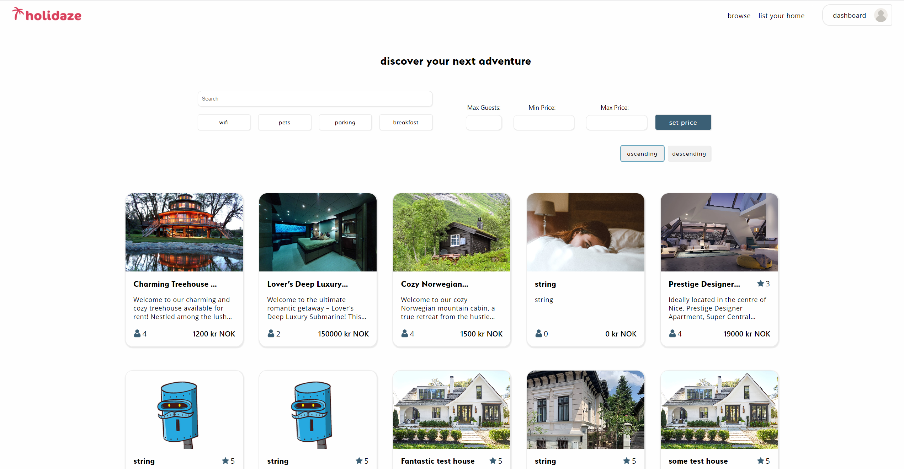

# Holidaze (project-exam-2)

This is the repository for the Holidaze website, a platform for renting bnb's worldwide. The website has been developed as a submission for the Projects Exam 2 for the Front End Development course at Noroff - School of Technology and Digital Media.

## Getting Started

These instructions will help you get a copy of the project up and running on your local machine for development and testing purposes.

## Prerequisites

You'll need Node.js and npm installed on your computer.

From your command line:

<pre>
# Check node version, should be v12 or higher
node --version

# Check npm version, should be v6 or higher
npm --version
</pre>

## Installation

Firstly, clone the repository to your local machine using Git:

<pre>
# Clone this repository
$ git clone https://github.com/yourusername/holidaze.git

# Go into the repository
$ cd holidaze
</pre>

Then install the dependencies in the local node_modules folder:

<pre>
# Install dependencies

$ npm i
</pre>

To run the development server:

<pre>
# Start the development server
$ npm run start
</pre>

The application should now be up and running at http://localhost:3000!

## For Testers

We encourage testers to write and execute their own unit tests. The project setup includes Jest, a popular JavaScript testing framework. Please follow the steps below:

1. Install Project Dependencies: Ensure that you've followed the installation steps as mentioned above.

2. Write Tests: Create your test files following the naming convention componentName.test.js, where componentName is the name of the component you're testing.

3. Run Tests: Once you've written your tests, you can run them using the following command:

<pre>
npm test
</pre>

This command will initiate Jest's test runner, which will execute all the tests present in your project.

During the testing phase, I would suggest that you cover the following areas:

- Functionality: Ensure all functionalities are working as expected.
- Design: Check the design across different browsers and screen sizes for compatibility.
- Performance: Verify that the site loads quickly and runs smoothly.
- Accessibility: Validate the website against WCAG standards.
- Usability: Confirm that the user experience is intuitive and the content is understandable.

Feel free to report any issues that you find so that they can be addressed.

## Built With

- React
- Styled-Components
- Helmet-Async
- React Hook Form
- Yup
- Lodash
- React DatePicker
- Date-fns
- Noroff API

## Website Link

https://bnb-holidaze.netlify.app/

## Author

Stian Dille Kornbakk

- Initial work - [S10ANDK](https://github.com/S10ANDK)
- Connect with me on [LinkedIn](https://www.linkedin.com/in/stian-dille-kornbakk-335b5a159/)
